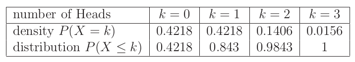

## Bonomial Distribution

"The binomial distribution fits to repeated trials each with a dichotomous out-come such as succes-failure, healthy-disease, heads-tails, purine-pyrimidine, etc. When there are n trials, then the number of ways to obtain k successes out of n is given by the binomial coefficient"

                                        n!/k!(n-k)!

```{R Binom}

# uncomment to see the binomial distribution
#TeachingDemos::vis.binom()
```


To use the formula to find the probability of an event:


### Example: Albinism

    If two carriers of the gen for albinism marry, then each of the children has probability of 1/4 of being albino. What is the probability for one child out of three to be albino?

R has a function to calculate the probabilty of a binomial: dbinom

```{R Albino Example}

# we know that...
p = 0.25

# we know they'll have 3 kids
n = 3

# we're asked the odds for k = 1 
k = 1

# just pass it to dbinom:
dbinom(k, n, p)
```

This gives use about 42%. 

      What are the odds that all 2 or fewer are albino?

This is calculated by summing the probabilities of the ks up to the one in question, ie:

```{R Cumulative}

# up the results form 0 to n
dbinom(0, n, p) + dbinom(1, n, p) + dbinom(2, n, p)
```
You can do this with a for-loop or use the pbinom function:

```{R pbinom}

# odds ot two or fewer 
pbinom(2, n, p)
```

This relationship can be visualized like this:




### Example: RNA Micro-array 

    RNA consists of a sequence of nucleotides A, G, U, and C, where the first two are purines and the   last two are pyrimidines. Suppose, for the purpose of illustration, that the length of a certain micro RNA is 22, that the probability of a purine equals 0.7, and that the process of placing purines and pyrimidines is binomially distributed. The event that our microRNA contains 14 purines can be represented by X = 14. The probability of this event can be computed by