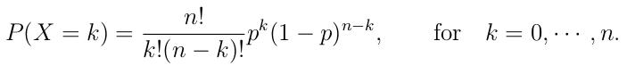

## Bonomial Distribution

"The binomial distribution fits to repeated trials each with a dichotomous out-come such as succes-failure, healthy-disease, heads-tails, purine-pyrimidine, etc. When there are n trials, then the number of ways to obtain k successes out of n is given by the binomial coefficient"

                                        n!/k!(n-k)!

```{R Binom}

# uncomment to see the binomial distribution
#TeachingDemos::vis.binom()
```


To use the formula to find the probability of an event:



### Example Albinism

        If two carriers of the gen for albinism marry, then each of the children has probability of 1/4          of being albino. What is the probability for one child out of three to be albino?

R has a function to calculate the probabilty of a binomial: dbinom

```{R Albino Example}

# we know that...
p = 0.25

# we know they'll have 3 kids
n = 3

# we're asked the odds for k = 1 
k = 1

# just pass it to dbinom:
dbinom(k, n, p)
```

This gives use about 42%. 

      What are the odds that all 3 are albino?