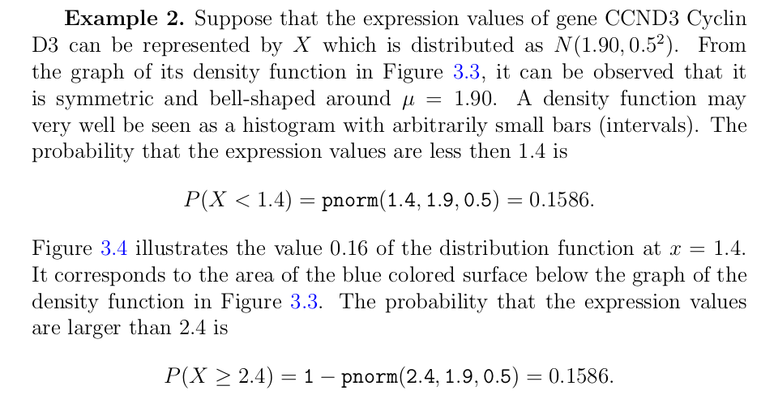
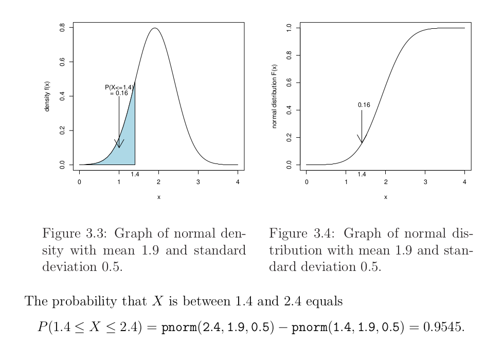

Here is the premise of the problem:



#### P(X < 1.4)

We can easily finds the probability that X < 1.4:
```{R Less Than or equal 1.4}

pnorm(1.4, 1.9, 0.5)
```

#### P(X >= 2.4)

To find the odds X is greater than or equal to 2.4 we subtract it from 1:
```{R Greater Than or equal 2.4}

# 1 minus the odds it's less than 2.4
1 - pnorm(2.4, 1.9, 0.5)
```

#### P(X > 1.4 & <= 2.4) 

What is the probability a number will fall in the middle?

According to the book:


The calculation in the book:

```{R Odds Between?}

# execute answer in the book:
pnorm(2.4, 1.9, 0.5) - pnorm(1.4, 1.9, 0.5)
```

...but the book says 95%. But if there is a 16% chance it's below 1.4 and a 16% chance that it's above 2.4, how can there be a 95% chance it's between the two?

```{R Double Check}

# if we have these odds...
below1.4 <- pnorm(1.4, 1.9, 0.5)

# and these odds...
atOrAbove2.4 <- 1 - pnorm(2.4, 1.9, 0.5)

# doesn't the odds it's in between have to be 1 minus them both?
1 - below1.4 - atOrAbove2.4
```

This is what we get from the calculation in the book, so I suspect the calculation is right but the answer is wrong.

If we include the 95:

```{R With 95?}

0.9545 + below1.4 + atOrAbove2.4
```

We can't odds on a scale of 1.27.