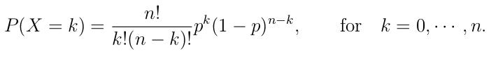
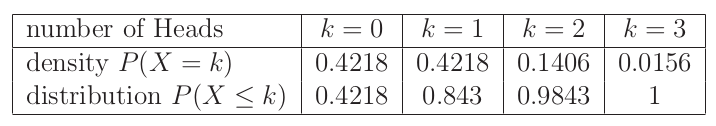
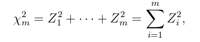

## Discrete Distribution

### Bonomial Distribution

"The binomial distribution fits to repeated trials each with a dichotomous out-come such as succes-failure, healthy-disease, heads-tails, purine-pyrimidine, etc. When there are n trials, then the number of ways to obtain k successes out of n is given by the binomial coefficient"

                                        n!/k!(n-k)!

```{R Binom}

# uncomment to see the binomial distribution
#TeachingDemos::vis.binom()
```


To use the formula to find the probability of an event:



#### Example: Albinism

    If two carriers of the gen for albinism marry, then each of the children has probability of 1/4 of being albino. What is the probability for one child out of three to be albino?

R has a function to calculate the probabilty of a binomial: dbinom

```{R Albino Example}

# we know that...
p = 0.25

# we know they'll have 3 kids
n = 3

# we're asked the odds for k = 1 
k = 1

# just pass it to dbinom:
dbinom(k, n, p)
```

This gives use about 42%. 

      What are the odds that all 2 or fewer are albino?

This is calculated by summing the probabilities of the ks up to the one in question, ie:

```{R Cumulative}

# up the results form 0 to n
dbinom(0, n, p) + dbinom(1, n, p) + dbinom(2, n, p)
```
You can do this with a for-loop or use the pbinom function:

```{R pbinom}

# odds ot two or fewer 
pbinom(2, n, p)
```

This relationship can be visualized like this:




#### Example: RNA Micro-array 

    RNA consists of a sequence of nucleotides A, G, U, and C, where the first two are purines and the last two are pyrimidines. Suppose, for the purpose of illustration, that the length of a certain micro RNA is 22, that the probability of a purine equals 0.7, and that the process of placing purines and pyrimidines is binomially distributed. The event that our microRNA contains 14 purines can be represented by X = 14. The probability of this event can be computed by
    
      n = 22
      Puries: A,G (p = 0.7)
      Pyrimidines: U,C (p = 0.3)
      
```{R Odds of 14 pyrimidines}

# the long way
(factorial(22)/(factorial(14)* factorial(22-14))) * (0.7^14)*(0.3^(22-14))

```

    What about the odds there are 13 or fewer?
    
```{R Odds of 13 or fewer pyrimidines}

# use the function as before
pbinom(13, 22, 0.7)
```

    The odds of ten or more?

```{R Odds of ten or more pyrimidines}

# use dbinom
sum(dbinom(11:22, 22, 0.7))
```

#### Visualizing the Distributions

```{R Visualiz Distributions}

desiredRange <- 1:22

plot(desiredRange, dbinom(desiredRange, size = 22, prob = 0.7), type = "h")
```

## Continuous Distribution

## Normal Distribution

In a normal distribution, aka "bell curve", the variables are the realization of a random variable X having a normal distribution (this is from the book but not a super helpful description). The distribution is said to have a mean ("mu") and a variance ("alpha squared"). This is described as N(mu, alpha^2). The odds of a value being less than a given number is expresed as P(X<=x).

#### Example: Normal Distribution

    Suppose the expression values of gene CCND3 Cyclin D3 can be represented as X which is ditributed as N(1.9, 0.5^2) (a normal distribution with a mean of 1.9 and a variance of 0.5^2). What is the probability that X is <= 1.4?

R has more distribution fuctions for this:

```{R Normal Distribution}

# we want to know 1.4, and gives the properties of the distribution as args
pnorm(1.4, 1.9, 0.5)
```

We can see the odds of about 16% of any given values being at or below 1.4.

      What about the chances that X is between 1.4 and 2.4?
      
```{R R Normal between values}

pnorm(2.4, 1.9, 0.5) - pnorm(1.4, 1.9, 0.5)
```


### Chi-Square

The Chi-Square distribution is used to test hypothesis about feequencies. It is defined as the sum of a set of the squared value of a set of random independent variables, with *m* degrees of freedom:




