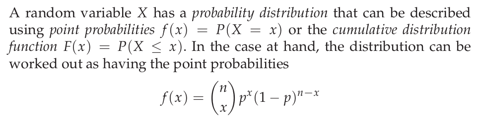
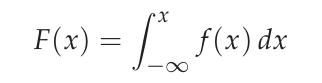
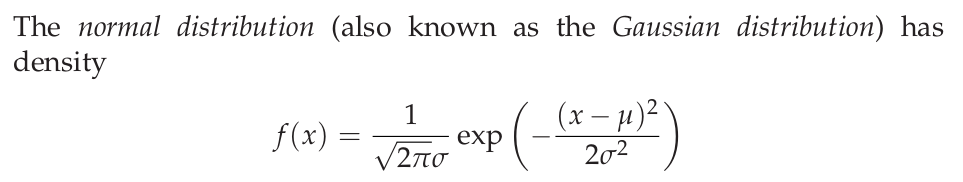

*note: indented blocks are excerpts from the tezt*

## Sampling & Probability

```{R Random Sampling - No replacement}

# pick random from 5 in a range of 1-40
sample(1:40, 5)
```

```{R Random Sampling - With Replacement}

# pick random from 5 in a range of 1-40
sample(c("Tails", "Heads"), 10, replace = TRUE)
```


```{R Random Sampling - With Replacement, Custom Odds}

# pick random from 5 in a range of 1-40
sample(c("Tails", "Heads"), 10, replace = TRUE, prob = c(0.9, 0.1))
```


The ways of getting a given 5 number combination with no replacement:
```{R Choose}

1/choose(40,5)
```

### Discrete Distributions



n and x are known as the binomial coefficients.

### Continuous Distributions 

#### Definitions

    In order to model continuous data, we need to define random variables
    that can obtain the value of any real number. Because there are infinitely
    many numbers infinitely close, the probability of any particular value will
    be zero, so there is no such thing as a point probability as for discrete-
    valued random variables. Instead we have the concept of a density. This is
    the infinitesimal probability of hitting a small region around x divided by
    the size of the region. The cumulative distribution function can be defined
    as before, and we have the relation:




#### Uniform Distribution

    The uniform distribution has a constant density over a specified interval (by
    default [ 0, 1 ] ).
    
#### Normal Distribution

The normal distribution follows a bell curve, the exact shape of which depends on the mean and standard deviation.



#### Distributions in R

    Four fundamental items can be calculated for a statistical distribution:
        • Density or point probability
        • Cumulated probability, distribution function
        • Quantiles
        • Pseudo-random numbers

R has a function for each of these. Usng the normal distribution as an example, there is *dnorm* for density, *pnorm* fo cumulative probability, *qnorm* for quantiles, and *rnorm* for random.


### Meaning of Density

        The density for a continuous distribution is a measure of the relative prob-
        ability of “getting a value close to x”. The probability of getting a value in
        a particular interval is the area under the corresponding part of the curve.
        
```{R Visualization of Normal Distribution}

curve(dnorm(x), from = -4, to = 4)
```

The vaule is continous and thus represented by the area under the curve. For discrete distributions, a histogram is more accurate:

```{R Binomial Histogram}

# sample size
x <- 0:50

# binomial with odds of .33/.66
plot(x, dbinom(x, size = 50, prob = 0.33), type = "h")
```


### Cumulitive Distribution Functions

These functions represent the chances of getting a value *or less* in the current distribution, for example, chances that x is 5 or lower. These are the functions in R that start with "p".

    Say that it is known that some biochemical measure in healthy individuals is well described by a normal distribution with a mean of 132 and a standard deviation of 13.

If a patient has a value of 160, what percent of the population has it?

```{R Patient Value}

# 100 minus the value of a 160 with given mean/sd
1 - pnorm(160, mean = 132, sd = 13)
```

Eseentially, it returns the probability of getting something smaller than you put into it:

```{R pnorm}

pnorm(160, mean = 132, sd = 13)
```

    Twenty patients are given two treatments each (blindly and in randomized order) and then asked whether treatment A or B worked better. It turned out that 16 patients liked A better. The question is then whether this can be taken as sufficient evidence that A actually is the better treatment or whether the outcome might as well have happened by chance even if the treatments were equally good. If there was no difference between the two treatments, then we would expect the number of people favouring treatment A to be binomially distributed with p = 0.5 and n = 20. How (im)probable would it then be to obtain what we have observed?

Essentially we're asking, what are the odds of this happening by coincidence. Or:
if we're dealing with 50/50 chances (the treatments are the same), what are the odds we get 16 out of 20?

The odds of getting a 16 or lower are:

```{R 16 or lower}

pbinom(16, size = 20, prob = 0.5)
```

```{R Odds of Coincidence Setup}

# observations of phenomona
obs <- 16

# number of reps
k <- 20

# assuming there was no difference:
p <- 0.5
```

odd thing: we need to subtract one from the 16 because we're "going in the other direction" (not finding the left of the value on the curve), and we need to count the 16 as part of the result that we're calculating

Thus as the books says "we need the probability of the observed or more extreme"

```{R Odds of Coincidence}

# odds of 16 or higher being chance
1 - pbinom(obs - 1, size = 20, prob = 0.5)
```

It looks pretty unlikely this would be chance. This is intuitive if we graph the results:

```{R}

x <- 1:20

plot(x, dbinom(x, size = 20, prob = 0.50), type = "h")
```


#### One vs. Two-tailed test

The book is a little vague about 1 vs 2 tailed tests, but it's pretty clear when supplemented by wikipedia:

    In statistical significance testing, a one-tailed test and a two-tailed test are alternative ways of computing the statistical significance of a parameter inferred from a data set, in terms of a test statistic. A two-tailed test is appropriate if the estimated value may be more than or less than the reference value, for example, whether a test taker may score above or below the historical average. A one-tailed test is appropriate if the estimated value may depart from the reference value in only one direction, for example, whether a machine produces more than one-percent defective products.

## Quantiles

    The quantile function is the inverse of the cumulative distribution function. The p-quantile is the value with the property that there is probability p of getting a value less than or equal to it. The median is by definition the 50% quantile.

### Use in Confidence Intervals


```{R Calculations of 95% Confidence Intervals}


# the mean
xbar <- 83

# std deviation
sigma <- 12

# persons measured
n <- 5

# standsard error of the mean
sem <- sigma/sqrt(n)
```

We now get the +/-. The book glosses over this a bit, but these are a static value not related to the figures above. They are related to the fact we're looking for 95%, not, say 90%, so we use those quantiles (more below).

```{R 95CI +/-}

# lower range 
xbar + sem * qnorm(0.025)

# upper range
xbar + sem * qnorm(0.975)
```

If we look closer we see the values for the qnorms:

```{R Introspect}

# what are these actually?
qnorm(0.025)
qnorm(0.975)
```

This makes it more clear they are the same value in either direction. This is often rounded to +/- 1.96. If we wan't a different % confidence interval, we would use a different value here:
(https://www.dummies.com/education/math/statistics/how-to-calculate-a-confidence-interval-for-a-population-mean-when-you-know-its-standard-deviation/).


#### What does this confidence interval tell us?

Supplementing with http://onlinestatbook.com/2/estimation/confidence.html:

     If repeated samples were taken and the 95% confidence interval was computed for each sample, 95% of the intervals would contain the population mean.

A more no-nonsense approach, copied/trimmed from: https://www.mathbootcamps.com/interpreting-confidence-intervals/

    Thinking About the Meaning of “95% Confident”
    
    Suppose that we have a sample of 45 people who work in a particular city. It took people in our sample an average time of 21 minutes to get to work one -way. The standard deviation was 9 minutes.
    
    Calculating a 95% confidence interval for the mean using a t-interval for the population mean, we get : (18.3, 23.7)

    > FALSE: “95% of the 45 workers take between 18.3 and 23.7 minutes to get to work”.

    While we used a sample to get the estimate, we are no longer talking about the sample. The confidence interval is now about ALL the workers that work in the city, not just the 45.
    
    > FALSE: “There is a 95% chance that the mean time it takes all workers in this city to get to work is between 18.3 and 23.7 minutes”.

    This is a very common misconception! It seems very close to true, but it isn’t because the population mean value is fixed. So, it is either in the interval or not. This is subtle but important. 
    
    >What is correct?
    
    “We are 95% confident that the mean time it takes all workers in this city to get to work is between 18.3 and 23.7 minutes.” This is a common shorthand for the idea that the calculations “work” 95% of the time.
    
    Why Don’t We Always Use a 99% Confidence Level?
    
    Seems to make sense right? Get the confidence level as high as you can! Well, as the confidence level increases, the margin of error increases . That means the interval is wider. So, it may be that the interval is so large it is useless! For example, what if I said that I am 99% confident that you will score between a 10 and a 100 on your next exam? How useful is that in predicting your performance? The interval is simply too wide. There are some instances where it doesn’t matter as much, but that is on a case by case basis.
    
This essentially stems from the fact we're trying to say sometihng about the *whole* population based on information about a *sample* of it. It's less confident than the charasmatic but false misconception in this example above.

## Random Numbers

Technically, theses are pseudo-random. There are numerous ways to get custom random sets in R.

```{R Random Numbers}

rnorm(10)
```

```{R custom mean/sd in normal}

rnorm(10, mean = 7, sd = 5)
```

```{R binomial with various options}

rbinom(10, size = 20, prob = 0.5)
```


## Excercises

    3.1 Calculate the probability for each of the following events:
    
    (a) A standard normally distributed variable is larger than 3.
    
```{R a}

 1 - pnorm(3) 
```

    (b) A normally distributed variable with mean 35 and standard deviation 6 is larger than 42.
 
```{R b}

1 - pnorm(42, mean = 35, sd = 6)
```

    (c) Getting 10 out of 10 successes in a binomial distribution with probability 0.8.

```{R c}

dbinom(10, size = 10, prob = 0.8) # or >dbinom(0, size=10, prob=.2)
```  

    (d) X < 0.9 when X has the standard uniform distribution.

```{R d}

```  

    (e) X > 6.5 in a χ^2 distribution with 2 degrees of freedom.

```{R e}

```   
